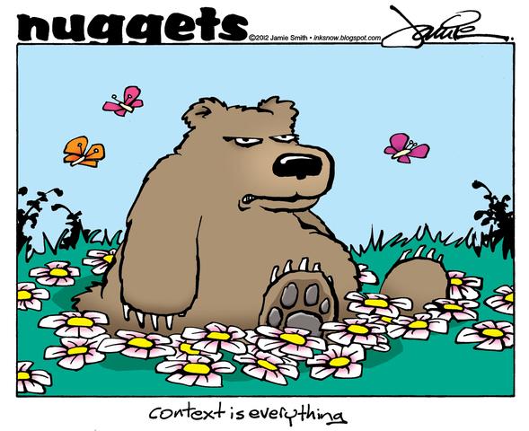
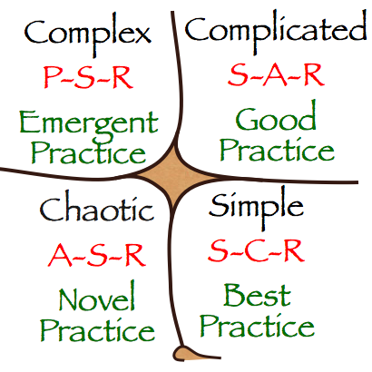

!SLIDE subsection bullets
# Complexity Theory for Agile Software Developers
## Nikolay Sturm (@nistude)

!SLIDE center
# test-first TDD can be frustrating

image by [Peter Alfred Hess](http://www.flickr.com/photos/peterhess/2976755407/)

!SLIDE center
# workaround: test-after TDD

image by [bildungskatastrophe](http://www.flickr.com/photos/bildungskatastrophe/3939078758)

!SLIDE center
# spike and stabilize

image by [GOTO Aarhus](http://gotocon.com/dl/goto-aarhus-2012/Web/Photo/GOTO_Dan_North_BW.png)

!SLIDE center
# context to the rescue

image by [Jamie Smith](http://2.bp.blogspot.com/-9GD9-oIDi_g/T9F3WDX4DAI/AAAAAAAAM2Q/KLaHRGXi3xg/s1600/nugg.context.web.jpg)

!SLIDE center
# the cynefin framework of sense-making

image by [David Snowden](http://commons.wikimedia.org/wiki/File:Cynefin.png)

!SLIDE center
# so what?

image by [Lucia Stewart](http://fineartamerica.com/featured/so-what-now-lucia-stewart.html)

!SLIDE center

